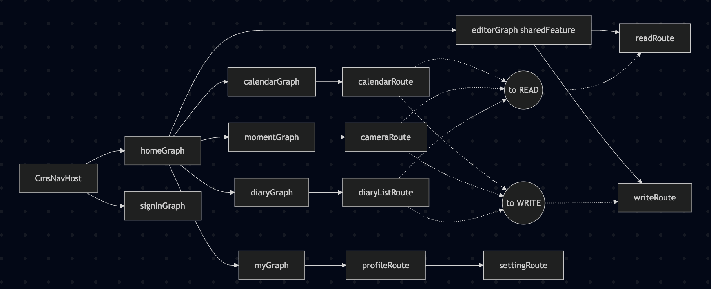

# Navigation

## 정의
- 앱 내에 여러 콘텐츠를 탐색하고 그 곳에 들어갔다 나올 수 있게 하는 상호작용을 의미
- 앱의 탐색을 관리하며, 앱 내의 각 대상과 대상 간의 연결을 포함하는 데이터 구조
- 왜 사용하는가?
    - 애니메이션 및 전환에 대한 리소스를 제공하고, 딩링크 구현을 최소한의 작업으로 탐색 창과 하단 탐색과 같은 패턴을 지원
    - 대상 간에 데이터를 안전성을 가지고 전달을 지원하며, UI 요소(nav bar, toolbar, bottom navigation 등)를 관리하기 쉬워짐. 즉, 앱 전반의 네비게이션과 UI 통제가 용이.하고 뒤로, 위로 가기 작업을 올바르게 도입

## 기본 이해
- 사용자가 앱 내에서 이동하는 방식을 나타냄
- 사용자는 일반적으로 탭하거나 클릭하여 Ui 요소와 상호작용하며 앱은 새 콘텐츠를 표시 응답

## 주요 개념

### 호스트
- 목적 : 현재 탐색 대상이 포함된 UI 요소. 즉 사용자가 앱을 탐색할 때 앱은 기본적으로 탐색 호스트 안팎으로 대상을 전환
- NavHost

### 그래프
- 목적 : 앱 내의 모든 탐색 대상과 연결 방법을 정의 하는 데이터 구조
- NavGraph

### 컨트롤러
- 목적 : 대상 간 탐색을 관리하는 중앙 코디네이터. 컨트롤러는 대상 간 탐색, 딥링크 처리, 백 스택 관리 등의 작업을 위한 메서드 제공
- NavController

### 목적지
- 목적 : 탐색 그래프의 노드. 사용자가 이 노드로 이동하면 호스트가 콘텐츠를 표시
- NavDestination (일반적으로 탐색 그래프를 구성할 때 생성)

### 경로
- 목적 : 대상과 대상에 필요한 데이터를 고유하게 식별. 경로를 사용하여 탐색할 수 있고, 경로를 따라 목적지로 이동
- 직렬화 가능한 모든 데이터 유형

## 기능
- 애니메이션 및 전환, 딥 링크, UI 패턴, 유형 안전성, ViewModel 지원 (ViewModel 의 범위를 탐색 그래프로 지정하여 그래프 대상 간에 UI 관련 데이터 공유), 프래그먼트 트랜잭션, 뒤로 및 위로

### 유형 안정성

Safe Args 가 제공하는 것과 같음

- Compose 에서 안전 라우트를 사용하려면 라우트를 나타내는 직렬화 가능한 클래스 또는 객체를 정의
- 직렬화 가능한 객체를 정의하려면 `@Serializable` 주석 사용.
- 경로에 사용할 유형을 결정
    - 객체 : 인수가 없는 경로에 객체를 사용
    - 클래스 : 인수가 있는 경로에는 클래스 또는 데이터 클래스 사용
    - KCalss<T> : 매개변수가 없는 클래스 또는 모든 매개변수에 기본값이 있는 클래스와 같이 인수를 전달할 필요가 없는 경우
```kotlin
NavHost(navController, startDestination = Home) {
     composable<Home> {
         HomeScreen(onNavigateToProfile = { id ->
             navController.navigate(Profile(id))
         })
     }
     composable<Profile> { backStackEntry ->
         val profile: Profile = backStackEntry.toRoute()
         ProfileScreen(profile.id)
     }
}
```

- `composable()` 는 유형 매개변수를 사용합니다. 즉, `composable<Profile>`
- 대상 유형을 정의하는 것은 `composable("profile")` 에서와 같이 `route 문자열`을 전달하는 것 보다 더 강력한 접근 방법
- 경로 클래스는 `val id : String` 와 같이 각 탐색 인수의 유형을 정의 하여 `NavArgment` 는 필요하지 않음
- 프로필 경로의 경우 `toRoute()` 확장 메서드는 `NavBackStackEntry` 및 인수에서 `Profile` 객체를 다시 만듬
- 유형 안전 경로로 이동
```kotlin
navController.navigate(Profile(id= 123))
```

- 참고 URL : https://developer.android.com/guide/navigation/design/type-safety?hl=ko

## 다중 모듈 프로젝트를 위한 탐색
- 다중 모듈에서 단일 대상, 관련 대상 캡슐화 하는 중첩 그래프, 중첩된 것 처럼 다름 탐색 그래프 파일 삽입하는 `include` 요소

### 중첩 그래프
- URL : https://developer.android.com/guide/navigation/design/nested-graphs?hl=ko
- 앱 내의 로그인 흐름, 기타 하위 흐름을 나타내기 좋고, 재사용 할 수 있으며, 특정 수준의 캡슐화 적용
- 외부 대상은 중첩 그래프 내의 대상에 직접 액세스 없기에 내부 로직이 그래프의 나머지 부분에 영향을 주지 않고 변경
- 스코프 분리(탭별 back stack 유지), 진입 지점 명확, 딥링크/`startDestination`/`popUpTo` 제어 쉬움, **공유 그래프(editorGraph)** 로 재사용성을 확보 위함
  